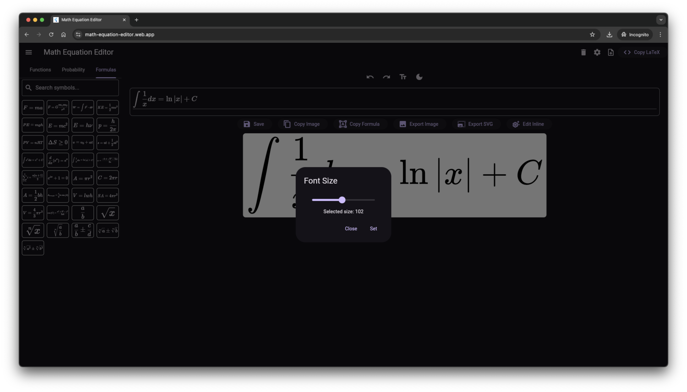

# Math Equation Editor

[](https://opensource.org/licenses/MIT)

A web based Flutter application for creating and editing mathematical equations with real-time LaTeX rendering.

Try it now at: https://math-equation-editor.web.app

## Overview

**Math Equation Editor** is a Flutter application designed to simplify the creation and editing of mathematical equations. With an intuitive interface and real-time rendering, users can input equations using LaTeX syntax and see the results instantly. The app leverages powerful packages like [flutter_math_fork](https://pub.dev/packages/flutter_math_fork) for LaTeX rendering and [flutter_bloc](https://pub.dev/packages/flutter_bloc) for state management. It also includes custom utilities for scalable brackets and equation parsing, enhancing the user experience.

## Features

- **Intuitive Equation Editor**: User-friendly interface supporting LaTeX syntax for complex equations.
- **Real-Time Rendering**: Instant visual feedback as you type your mathematical expressions.
- **Scalable Brackets**: Dynamic bracket sizing implemented in `scalable_brackets.dart`.
- **State Management**: Efficient state handling using the BLoC pattern with `flutter_bloc`.
- **Persistent Storage**: Save and load your equations with `shared_preferences`.
- **Web-Based Solution**: Currently optimized for web platform, with architecture ready for future expansion to Android, iOS, and Windows.
- **Export Options**: Export equations as images, SVG, EPS, or OLE objects.
- **Image Editor (Beta)**: Edit copied images directly within the app - crop, adjust, and enhance images on the go (Note: This feature is in development, use with caution).

## Screenshots

### Desktop Web Interface
<p align="center">
  
</p>

### Responsive Design
<p align="center">
  
</p>

### Features Showcase
<p align="center">
  <table>
    <tr>
      <td></td>
      <td></td>
    </tr>
    <tr>
      <td align="center"><b>Light Theme</b></td>
      <td align="center"><b>Dark Theme</b></td>
    </tr>
    <tr>
      <td></td>
      <td></td>
    </tr>
    <tr>
      <td align="center"><b>Font Size Adjustment</b></td>
      <td align="center"><b>Symbol Selector</b></td>
    </tr>
  </table>
</p>

### Image Editor (Beta)
<p align="center">
  
</p>

## Getting Started

### Try Online

Visit https://math-equation-editor.web.app to use the application directly in your browser without installation.

### Prerequisites

- **Flutter SDK**: [Installation Guide](https://flutter.dev/docs/get-started/install)
- **Dart SDK**: Ensure compatibility with the version specified in `pubspec.yaml`
- **IDE**: Visual Studio Code, Android Studio, or any preferred code editor

### Installation

1. **Clone the Repository**

   ```bash
   git clone https://github.com/your-username/math_equation_editor.git
   ```

2. **Navigate to the Project Directory**

   ```bash
   cd math_equation_editor
   ```

3. **Install Dependencies**

   ```bash
   flutter pub get
   ```

4. **Run the Application**

   ```bash
   flutter run -d chrome
   ```

   Note: While the architecture supports cross-platform development, the application is currently optimized for web usage.

## Usage

1. **Launch the Application**

   Open the app on your chosen platform.

2. **Access the Equation Editor**

   The main interface provides an input field for entering mathematical expressions.

3. **Input Expressions**

   - Use the keyboard or on-screen symbols to input equations.
   - Supports standard LaTeX commands for mathematical notation.

4. **Real-Time Rendering**

   - Equations are rendered below the input field as you type.
   - Adjustments to the expression update the rendering instantly.

5. **Saving and Loading Equations**

   - Use the save option to store your current equation.
   - Access saved equations through the load option for future editing.

6. **Exporting Equations**

   - Export your equations in various formats like PNG, SVG, or EPS.
   - Use the export options available in the application menu.

7. **Image Editing (Beta Feature)**

   - Copy and paste images directly into the editor
   - Basic image manipulation tools available
   - ⚠️ Note: This feature is in active development and may have limitations

## License

This project is licensed under the MIT License - see the [LICENSE](LICENSE) file for details.

## Acknowledgements

- **[flutter_math_fork](https://pub.dev/packages/flutter_math_fork)**: For advanced LaTeX rendering capabilities.
- **[flutter_bloc](https://pub.dev/packages/flutter_bloc)**: For efficient state management using the BLoC pattern.
- **[EasyLaTeX](https://github.com/najeira/easy-latex)**: Inspiration and resources for handling LaTeX in Flutter.

## Contact

For questions, suggestions, or issues, please open an [issue](https://github.com/your-username/math_equation_editor/issues) on GitHub or contact the repository owner at [pawanjoshi055@gmail.com].